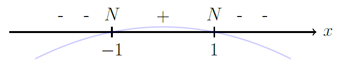
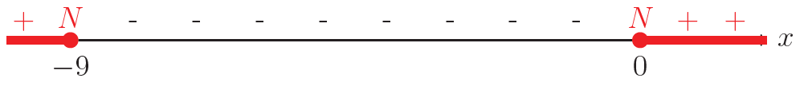
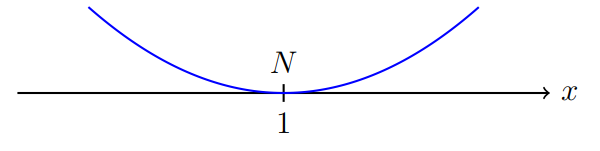
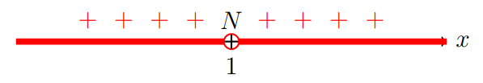
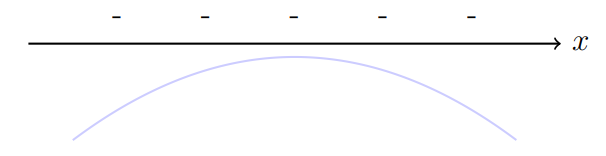

# Disequazioni di secondo grado  
## Metodo di risoluzione geometrico (studio del segno di funzione)

Risolvi la seguente disequazione:

$$
x^2 - 4 < 0
$$

---

### 1️⃣ Risolvo l’equazione associata

Per determinare i punti di intersezione della parabola con l’asse \(x\), risolvo
l’equazione associata:

$$
x^2 - 4 = 0
$$

$$
x_1 = -2 \qquad x_2 = 2
$$

---

### 2️⃣ Determino la concavità

Il coefficiente del termine \(x^2\) è

$$
a = 1 > 0
$$

quindi la parabola ha **concavità rivolta verso l’alto**.

---

### 3️⃣ Studio del segno della funzione

Consideriamo la funzione:

$$
f(x) = x^2 - 4
$$

Disegniamo la parabola rispetto l'asse delle $x$

studiamo il **segno della funzione** nei vari intervalli.

In particolare:

- mettiamo il segno **+** dove la parabola è **sopra** l’asse \(x\)

- mettiamo il segno **−** dove la parabola è **sotto** l’asse \(x\)

- mettiamo **N** nei punti in cui la funzione si annulla

---

### 4️⃣ Soluzione della disequazione

La disequazione richiede:

$$
f(x) < 0
$$

Quindi consideriamo **solo gli intervalli in cui la funzione è negativa**.

$$
\boxed{S = \{-2 < x < 2\}}
$$

---
##  Alcuni esempi

=== "Esempio 1"

    $$
    3x^2 - 6x > 0
    $$

    Risolvo l’equazione associata

    $$
    3x^2 - 6x = 0
    $$

    $$
    3x(x - 2) = 0
    $$

    $$
    x = 0 \quad \text{oppure} \quad x = 2
    $$

    La concavità della parabola è positiva in quanto $a > 0$, quindi

      
    

    La disequazione richiede:

    $$
    f(x) > 0
    $$

    

    $$
    \boxed{S = \{x < 0\} \cup \{x > 2\}}
    $$

    ---

=== "Esempio 2"

    $$
    -2x^2 + 2 < 0
    $$

    Risolvo l’equazione associata

    $$
    -2x^2 + 2 = 0
    $$

    $$
    x^2 = 1
    $$

    $$
    x = \pm 1
    $$

    La concavità della parabola è negativa in quanto $a < 0$, quindi

      
    

    La disequazione richiede:

    $$
    f(x) < 0
    $$

    

    $$
    \boxed{S = \{x < -1\} \cup \{x > 1\}}
    $$

    ---

=== "Esempio 3"

    $$
    -2x^2 - 6x + 8 \ge 0
    $$

    Risolvo l’equazione associata

    $$
    -2x^2 - 6x + 8 = 0
    $$

    grazie alla formula quadratica ottengo

    $$
    x = -4 \quad \text{oppure} \quad x = 1
    $$

    La concavità della parabola è negativa in quanto $a < 0$, quindi

      
    

    La disequazione richiede:

    $$
    f(x) \ge 0
    $$

    

    $$
    \boxed{S = \{-4 \le x \le 1\}}
    $$

    ---

=== "Esempio 4"

    $$
    -x^2 - 9x \le 0
    $$

    Risolvo l’equazione associata

    $$
    -x^2 - 9x = 0
    $$

    $$
    -x(x + 9) = 0
    $$

    $$
    x = 0 \quad \text{oppure} \quad x = -9
    $$

    La concavità della parabola è negativa in quanto $a < 0$, quindi

      
    

    La disequazione richiede:

    $$
    f(x) \le 0
    $$

    

    $$
    \boxed{S = \{x \le -9\} \cup \{x \ge 0\}}
    $$

##  Altri esempi particolari

=== "Esempio 1"

    $$
    x^2-2x+1 > 0
    $$

    Risolvo l’equazione associata

    $$
    x^2-2x+1 = 0
    $$

    unica soluzione

    $$
    x = 1
    $$

    La concavità della parabola è positiva in quanto $a > 0$, quindi

      
    

    La disequazione richiede:

    $$
    f(x) > 0
    $$

    

    $$
    \boxed{S = \{x < 1\} \cup \{x > 1\}}
    $$

=== "Esempio 2"

    $$
    -3x^2-3 > 0
    $$

    Risolvo l’equazione associata

    $$
    -3x^2-3 = 0
    $$

    $$
    x^2 = -1
    $$

    L'equazione è **impossibile** e quindi non ci sono punti di nullo $N$

    La concavità della parabola è negativa in quanto $a < 0$, quindi

      

    La parabola è quindi **tutta negativa**

    

    La disequazione richiede:

    $$
    f(x) > 0
    $$

    Ma la funzione non è mai positiva, dunque la disequazione è **impossibile**

    $$
    \boxed{S = \emptyset}
    $$

---

  <a href="../3_grado/" class="md-button md-button--primary">
    Disequazioni superiori →
  </a>

