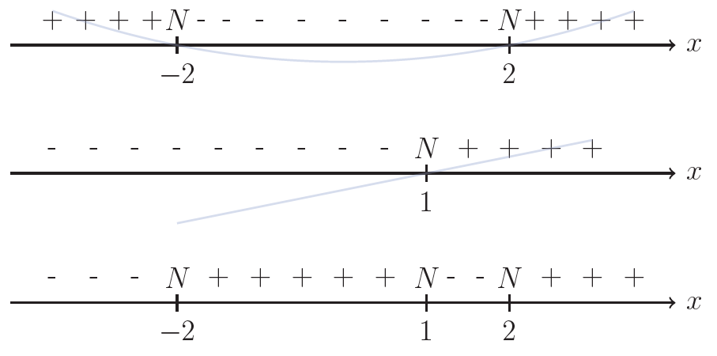
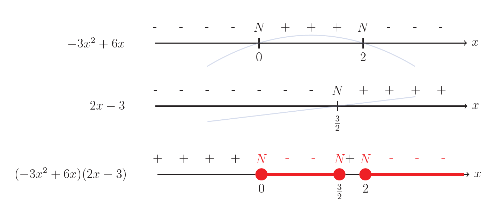

# Disequazioni di grado superiore al secondo

## Metodo risolutivo

Risolvi la disequazione 

$$(x - 1)(x^2 - 4) > 0$$

### 1️⃣ Studio il segno dei singoli fattori

Il primo fattore $x-1$ è una retta crescente che interseca in $x=1$

Il secondo fattore $x^2-4$ è una parabola con concavità positiva che interseca in $x= \pm 2$

### 2️⃣ Moltiplico i segni

allineo verticalmente i due segni, e li moltiplico tra loro.

Il segno risultato lo riporto al di sotto

### 3️⃣ Soluzione della disequazione

La disequazione richiede:

$$
f(x) > 0
$$

Quindi consideriamo **solo gli intervalli in cui la funzione è positiva**.

$$
\boxed{S = \{-2 < x < 1\} \cup \{x > 2\}}
$$

---
##  Alcuni esempi

=== "Esempio 1"

    $$
    (-x^2 + 9)(3x - 4) \geq 0
    $$

    

    
    $$
    \boxed{S = \{x \leq -3\} \cup \{-\frac{4}{3} \leq x \leq 3\} }
    $$

=== "Esempio 2"

    $$
    (-3x^2 + 6x)(2x - 3) \leq 0
    $$

    

    
    $$
    \boxed{S = \{x \geq 2\} \cup \{0 \leq x \leq \frac{3}{2}\} }
    $$

---

  <a href="../fratte/" class="md-button md-button--primary">
    Disequazioni fratte →
  </a>

