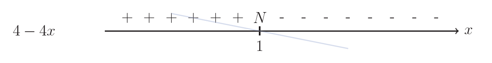
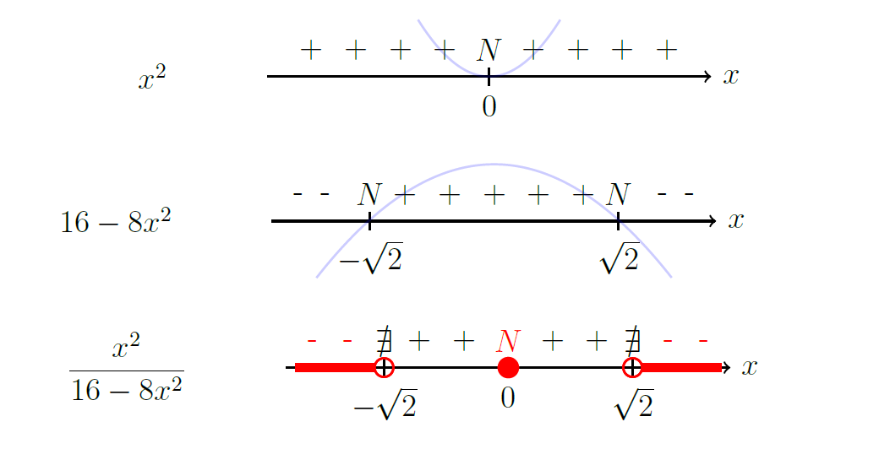

# Disequazioni fratte

## Metodo risolutivo

Risolvi la disequazione 

$$\dfrac{4 - 4x}{x^2 - 3x - 4} \geq 0$$

### 1️⃣ Studio il segno del numeratore e del denominatore

Il **numeratore** $4-4x$ è una retta decrescente che interseca in $x=1$

Il **denominatore** $x^2 - 3x - 4$ è una parabola con concavità positiva che interseca in $x = 4$, $x = -1$

### 2️⃣ Moltiplico i segni

allineo verticalmente i due segni, e li **divido**(1) tra loro .
{ .annotate }

1.  La regola dei segni funziona come per la moltiplicazione

Il segno risultato lo riporto al di sotto

L'unica differenza è che i punti di nullo ($N$) del denominatore diventano **punti di non esistenza** ($\nexists$) della funzione

### 3️⃣ Soluzione della disequazione

La disequazione richiede:

$$
f(x) \geq 0
$$

Quindi consideriamo solo gli intervalli in cui la funzione è **positiva** oppure **nulla**.

$$
\boxed{S = \{x < -1\} \cup \{1 \leq x < 4\} }
$$

---
##  Alcuni esempi

=== "Esempio 1"

    $$
    \dfrac{x^2}{16-8x^2}\leq 0 
    $$

    

    
    $$
    \boxed{S = \{x < -\sqrt{2}\} \cup \{ x = 0\} \cup \{x > \sqrt{2}\} }
    $$

    ---

=== "Esempio 2"

    $$
    \dfrac{2x^2+4}{3x} \geq 0 
    $$

    $$
    \boxed{S = \{x > 0\}  }
    $$

    ---

## Esercizi con soluzione

| Disequazione | Soluzione |
|----------|-----------|
| $\dfrac{x^2+3x-10}{30x-9x^2}<0$ | $S=\{ x<-5\}\cup\{0<x<2\}\cup\{x>\tfrac{10}{3}\}$ |
| $\dfrac{-x^2+8x-7}{24x-3x^2}\le 0$ | $S=\{ 0<x\le 1\}\cup\{7\le x<8\}$ |
| $\dfrac{24-6x^2}{-7x^2-21x}\ge 0$ | $S=\{ x<-3\}\cup\{-2\le x<0\}\cup\{x\ge 2\}$ |
| $\dfrac{4x^2-8x}{x^2-2x-3}\ge 0$ | $S=\{ x<-1\}\cup\{0\le x\le 2\}\cup\{x>3\}$ |
| $\dfrac{5x^2}{3(-8x^2-72)}\ge 0$ | $S=\{0\}$ |
| $\dfrac{5x^2-4x+4}{\tfrac{8x^2}{7}-10x}<0$ | $S=\{ 0<x<\tfrac{35}{4}\}$ |
| $\dfrac{-x^2-7x}{3x^2+4x+5}<0$ | $S=\{ x<-7\}\cup\{x>0\}$ |
| $\dfrac{5x^2+5x+4}{5-5x^2}\le 0$ | $S=\{ x<-1\}\cup\{x>1\}$ |
